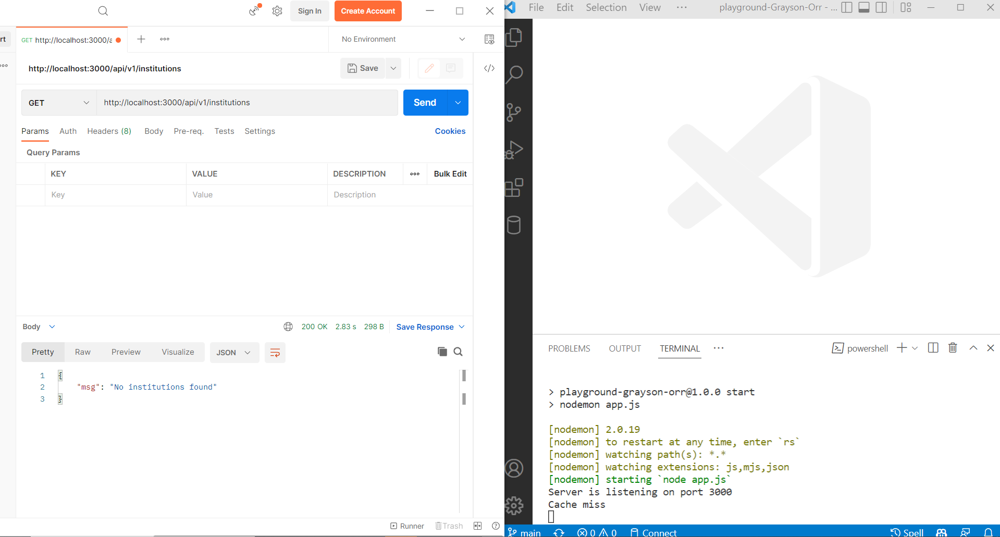
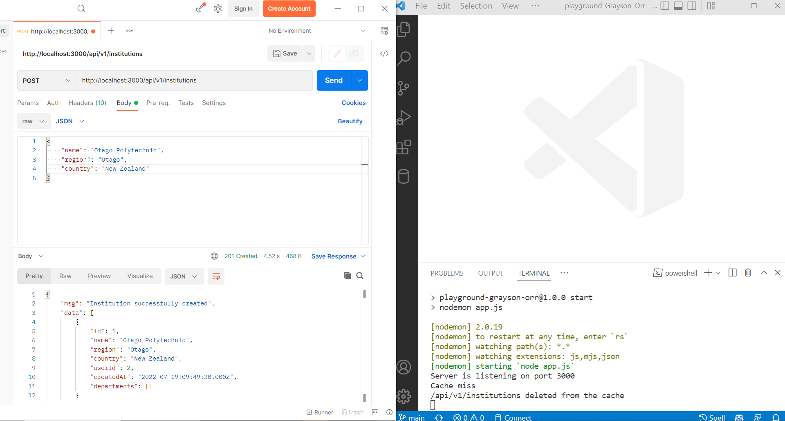
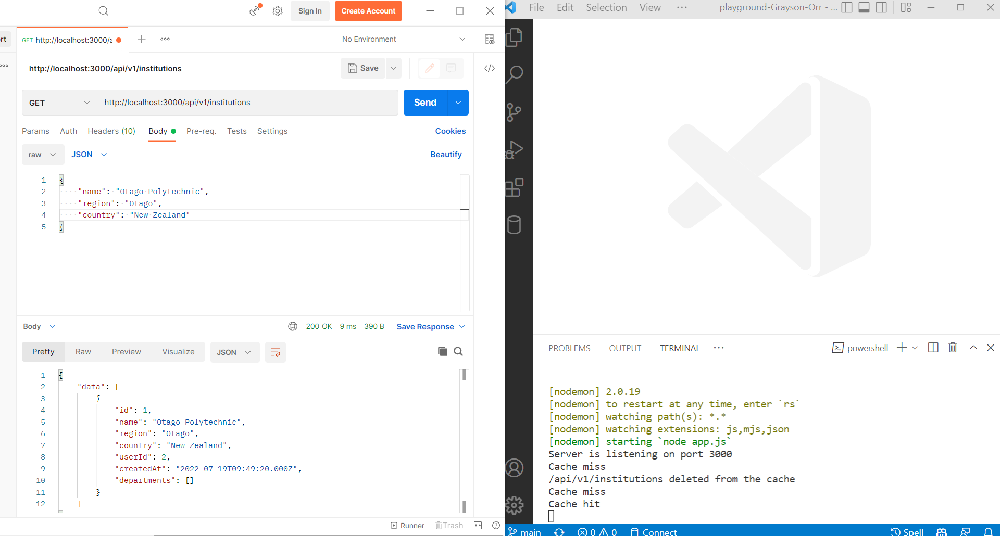
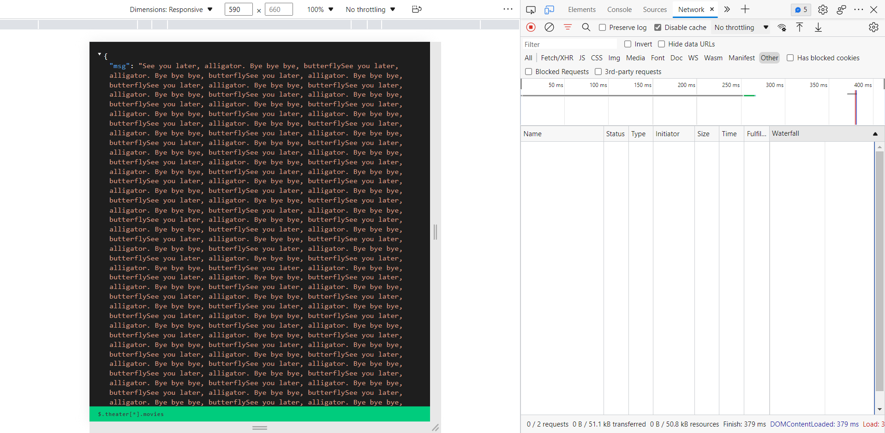

# 04: Caching and Compression

If you get stuck, a completed version of this project is available in the **exemplar** directory.

## Caching

**Caching** is a technique that stores a copy of a resource in a cache. A cache is a temporary storage area. When a resource is requested, a copy of the resource is returned from the cache if it exists. If the resource does not exist in the cache, the resource is retrieved from the source and stored in the cache for future use. This process is called a **cache miss**. If the resource does exist in the cache, the resource is returned from the cache. This process is called a **cache hit**. **Caching** is a great way to improve the performance of an application.

How does the **cache** know when there is a data change?

Firstly, let us understand a couple of important caching mechanisms:
- **Entity Tag (ETag)**: An **ETag** is a unique identifier for a specific version of a resource. It is used to determine if the resource has changed. If the resource has changed, the **ETag** changes. If the resource has not changed, the **ETag** remains the same.
- **Last-Modified Header**: The **Last-Modified** header is a response header that indicates the date and time at which the resource was last modified.

When a client requests a resource, the server sends the resource along with an **ETag** and a **Last-Modified** header. The client stores the **ETag** and the **Last-Modified** header. When the client requests the resource again, it sends the **ETag** and the **Last-Modified** header to the server. The server compares the **ETag** and the **Last-Modified** header with the current **ETag** and the current **Last-Modified** header. If the **ETag** and the **Last-Modified** header match the current **ETag** and the current **Last-Modified** header, the server returns a **304 Not Modified** response. This means that the resource has not changed. If the **ETag** and the **Last-Modified** header do not match the current **ETag** and the current **Last-Modified** header, the server returns the resource along with a new **ETag** and a new **Last-Modified** header. 

View this video to learn more about how **caching** works - <https://youtu.be/6FyXURRVmR0>

To get started, run the following command:

```bash
npm install node-cache
```

Check the `package.json` file to ensure you have installed `node-cache`.

In the `middleware` directory, create a new file called `cacheRoute.js`. In the `cacheRoute.js` file, add the following code:

```js
import NodeCache from "node-cache";

// Create a new cache instance with a 5-minute Time to Live (stdTTL) and a 310-second check period
const cache = new NodeCache({ stdTTL: 300, checkperiod: 310 });

// Define a middleware function for caching responses
const cacheRoute = (req, res, next) => {
  // Generate a unique cache key based on the request's URL and authorization header
  const key = req.originalUrl + req.headers.authorization;

  const cachedRes = cache.get(key);

  // Check if it is not a GET request and there's a cached response for the key
  if (req.method !== "GET" && cachedRes) {
    // Log a message indicating that the cached entry is deleted from the cache
    console.log(`${key} deleted from the cache`);
    
    // Delete the cached response to maintain consistency
    cache.del(key);
    
    // Proceed to the next middleware in the stack
    return next();
  } 
  // If there is a cached response, and it is a GET request, return it
  else if (cachedRes) {
    // Log a message indicating a cache hit
    console.log("Cache hit");
    
    // Send the cached response back to the client
    return res.json(cachedRes);
  } 
  // If there's no cached response, it is a cache miss
  else {
    // Log a message indicating a cache miss
    console.log("Cache miss");
    
    // Create a custom `res.json()` method that wraps the original method
    res.originalSend = res.json;
    res.json = (body) => {
      // Call the original `res.json()` method to send the response to the client
      res.originalSend(body);
      
      // Cache the response with the generated key
      cache.set(key, body);
    };
    
    // Proceed to the next middleware in the stack
    return next();
  }
};

export default cacheRoute;
```

## app.js

In the `app.js` file, add the following import:

```js
// Declare this with your other imports
import cacheRouteMiddleware from "./middleware/cacheRoute.js";
```

Then add the following **middleware**:

```js
// Declare this under app.use(limiter);
app.use(cacheRouteMiddleware);
```

## Postman

Test the changes in **Postman** before you move on to the **Formative Assessment** section.

The screenshot below is an example of a cache miss.



The screenshot below is an example of deleting a key from the cache.



The screenshot below is an example of a cache hit.



## Compression

Compression with **GZIP** helps decrease the downloadable amount of data served to the client. This compression technique can improve the application's performance by significantly reducing the payload size, i.e., **JSON** response.

View this video to learn more about how **GZIP** works - <https://www.youtube.com/watch?v=NLtt4S9ErIA>

To get started, run the following command:

```bash
npm install compression
```

Check the `package.json` file to ensure you have installed `compression`.

In the `app.js` file, import `compression`. For example:

```js
import compression from "compression";
```

For testing purposes, add the following `GET` route:

```js
app.get("/api/v1/optimisation", (req, res) => {
  const text = "See you later, alligator. Bye bye bye, butterfly";
  res.json({ msg: text.repeat(1000) });
});
```

In a browser, navigate to <http://localhost:3000/api/v1/optimisation>. Open the **development tools** and keep an eye on the amount of kilobytes transferred over the network.

The screenshot below is an example of before compression.



As you can see, there is 51.1 kilobytes transferred over the network.

Add the following **middleware**:

```js
app.use(compression());
```

In the browser, refresh the page.

The screenshot below is an example of after compression.


As you can see, there is 3.4 kilobytes transferred over the network which is significantly lower than the previous benchmark.

# Formative Assessment

Before you start, create a new branch called **04-formative-assessment**.

If you get stuck on any of the following tasks, feel free to use **ChatGPT** permitting, you are aware of the following:

- If you provide **ChatGPT** with a prompt that is not refined enough, it may generate a not-so-useful response
- Do not trust **ChatGPT's** responses blindly. You must still use your judgement and may need to do additional research to determine if the response is correct
- Acknowledge that you are using **ChatGPT**. In the **README.md** file, please include what prompt(s) you provided to **ChatGPT** and how you used the response(s) to help you with your work

## Task Tahi

If you have not already, implement the code examples above before you move on to **Formative Assessment Submission**.

# Formative Assessment Submission

Create a new pull request and assign **grayson-orr** to review your practical submission. Please do not merge your own pull request.
