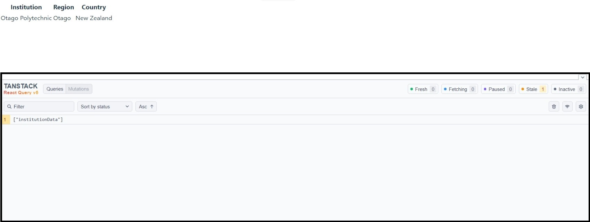

# 08: React Query

If you get stuck, a completed version of this project is available in the **exemplar** directory.

## Preparation

1. Create a new project using **Create Vite App**:

```bash
npm init vite@latest
```

2. When prompted, select the following options:

- Project name: **08-react-query**
- Framework: **React**
- Variant: **JavaScript + SWC**

3. `cd` into **08-react-query**, run `npm install` and open it in your code editor.

## React Query

**React Query** is a library that helps you fetch, cache and update data in your React applications. It is a great alternative to Redux and other state management libraries. It is also a great alternative to the `fetch` API and `axios` for fetching data from APIs.

### Setup

1. To get started, install the library:

```bash
npm install @tanstack/react-query
```

2. In `src/main.jsx`, import the `QueryClientProvider` and `QueryClient` from `@tanstack/react-query`:

```js
import { QueryClientProvider, QueryClient } from "@tanstack/react-query";
```

3. Create a new instance of `QueryClient`:

```js
export const queryClient = new QueryClient();
```

4. Wrap the `App` component in the `QueryClientProvider`:

```js
<React.StrictMode>
  <QueryClientProvider client={queryClient}>
    <App />
  </QueryClientProvider>
</React.StrictMode>,
```

### Query Example

In `src/App.jsx`, update the code to the following:

```js
import { useQuery } from "@tanstack/react-query";

const App = () => {
  const { isLoading, data: institutionData } = useQuery({
    queryKey: ["institutionData"],
    queryFn: () =>
      fetch(
        "https://id607001-graysono-1i3w.onrender.com/api/institutions"
      ).then((res) => res.json()),
  });

  if (isLoading) return "Loading...";

  return (
    <>
      <table>
        <thead>
          <tr>
            <th>Institution</th>
            <th>Region</th>
            <th>Country</th>
          </tr>
        </thead>
        <tbody>
          {institutionData.msg ? (
            <tr>
              <td colSpan="3">{institutionData.msg}</td>
            </tr>
          ) : (
            institutionData.data.map((institution) => (
              <tr key={institution.id}>
                <td>{institution.name}</td>
                <td>{institution.region}</td>
                <td>{institution.country}</td>
              </tr>
            ))
          )}
        </tbody>
      </table>
    </>
  );
};

export default App;
```


### Developer Tools

1. Install the `react-query-devtools` package:

```bash
npm install @tanstack/react-query-devtools --save-dev
```

2. In `src/main.jsx`, import the `ReactQueryDevtools` component from `@tanstack/react-query-devtools`:

```js
import { ReactQueryDevtools } from "@tanstack/react-query-devtools";
```

3. Add the `ReactQueryDevtools` component to the `QueryClientProvider`:

```js
<React.StrictMode>
  <QueryClientProvider client={queryClient}>
    <App />
    <ReactQueryDevtools initialIsOpen={false} />
  </QueryClientProvider>
</React.StrictMode>,
```

Click on the icon in the bottom right corner to open the developer tools.




## Mutation Example

1. In `src/App.jsx`, import the `useMutation` hook from `@tanstack/react-query` and `queryClient` from `src/main.jsx`:

```js
import { useQuery, useMutation } from "@tanstack/react-query";

import { queryClient } from "./main";
```

2. Using the `useMutation` hook, create a new mutation:

```js
const App = () => {
  // ...
  const { mutate: postInstitutionMutation, data: postInstitutionData } =
    useMutation({
      mutationFn: (institution) =>
        fetch("https://id607001-graysono-1i3w.onrender.com/api/institutions", {
          method: "POST",
          headers: {
            "Content-Type": "application/json",
          },
          body: JSON.stringify({
            name: institution.name,
            region: institution.region,
            country: institution.country,
          }),
        }).then((res) => res.json()),
      onSuccess: () => queryClient.invalidateQueries("institutionData"),
    });
  // ...
};

export default App;
```

**What is a mutation?**

A mutation is a function that performs an asynchronous task. It is similar to a query, but it is used for updating data.

3. We are going to use `react-hook-form` to handle the form. Install the package:

```bash
npm install react-hook-form
```

`react-hook-form` is a library that helps you create forms in React. It is a great alternative to `Formik` and other form libraries.

4. Declare the `useForm` hook from `react-hook-form`:

```js
// ...
import { useForm } from "react-hook-form";
// ...
const App = () => {
  const institutionForm = useForm();
  // ...
};

export default App;
```

5. Create a new function called `handleInstitutionSubmit`:

```js
const App = () => {
  // ...
  const handleInstitutionSubmit = (values) => postInstitutionMutation(values);
  // ...
};
```

6. Update the `then()` method with the following:

```js
const App = () => {
  // ...
  const { mutate: postInstitutionMutation, data: postInstitutionData } =
    useMutation({
      mutationFn: (institution) =>
        fetch("https://id607001-graysono-1i3w.onrender.com/api/institutions", {
          method: "POST",
          headers: {
            "Content-Type": "application/json",
          },
          body: JSON.stringify({
            name: institution.name,
            region: institution.region,
            country: institution.country,
          }),
        }).then((res) => {
          if (res.status === 201) {
            institutionForm.reset((formValues) => ({
              ...formValues,
              name: "",
              region: "",
              country: "",
            }));
          }
          return res.json();
        }),
      onSuccess: () => queryClient.invalidateQueries("institutionData"),
    });
  // ...
};

export default App;
```

7. Declare a `form` element in the `return` statement above the `table` element:

```js
// ...
return (
  <>
    <form onSubmit={institutionForm.handleSubmit(handleInstitutionSubmit)}>
      <label htmlFor="name">Name</label>
      <input
        type="text"
        id="name"
        name="name"
        {...institutionForm.register("name")}
      />
      <label htmlFor="region">Region</label>
      <input
        type="text"
        id="region"
        name="region"
        {...institutionForm.register("region")}
      />
      <label htmlFor="country">Country</label>
      <input
        type="text"
        id="country"
        name="country"
        {...institutionForm.register("country")}
      />
      <button type="submit">Submit</button>
    </form>
    <p>{postInstitutionData?.msg}</p>
    {/* // ...  */}
  </>
);
// ...
```


## Infinite Query Example

1. In `src/App.jsx`, import the `useInfiniteQuery` hook from `@tanstack/react-query`:

```js
// ...
import { useQuery, useMutation, useInfiniteQuery } from "@tanstack/react-query";
```

2. Using the `useInfiniteQuery` hook, create a new infinite query:

```js
const App = () => {
  // Comment out the existing query

  // const { isLoading, data: institutionData } = useQuery({
  //   queryKey: ["institutionData"],
  //   queryFn: () =>
  //     fetch(
  //       "https://id607001-graysono-1i3w.onrender.com/api/institutions"
  //     ).then((res) => res.json()),
  // });

  const {
    isLoading,
    data: institutionData,
    isFetchingNextPage,
    hasNextPage,
    fetchNextPage,
  } = useInfiniteQuery({
    queryKey: ["institutionData"],
    queryFn: (
      { pageParam = 1 } // Use the pageParam to fetch the next page. If the pageParam is undefined, fetch the first page
    ) =>
      fetch(
        `https://id607001-graysono-1i3w.onrender.com/api/institutions?page=${pageParam}&amount=5`
      ).then((res) => res.json()),
    getNextPageParam: (prevData) => prevData.nextPage, // Get the next page from the previous data. If a next page does not exist, return undefined
  });
  // ...
};

export default App;
```

**What is an infinite query?**

An infinite query is a query that fetches data in pages. It is similar to a query, but it is used for fetching large amounts of data.

3. Update the `table` element to the following:

```js
return (
  <>
    {/* /...  */}
    <table>
      <thead>
        <tr>
          <th>Institution</th>
          <th>Region</th>
          <th>Country</th>
        </tr>
      </thead>
      <tbody>
        {institutionData.pages[0].msg ? (
          <tr>
            <td colSpan="3">{institutionData.pages[0].msg}</td>
          </tr>
        ) : (
          <>
            {institutionData.pages
              .flatMap((data) => data.data)
              .map((institution) => (
                <tr key={institution.id}>
                  <td>{institution.name}</td>
                  <td>{institution.region}</td>
                  <td>{institution.country}</td>
                </tr>
              ))}
          </>
        )}
      </tbody>
    </table>
  </>
);
```

4. Declare the following in the `return` statement under the `table` element:

```js
{
  hasNextPage && (
    <button onClick={() => fetchNextPage()}>
      {isFetchingNextPage ? "Loading..." : "Load More"}
    </button>
  );
}
```


Click on the **Load More** button to fetch the next page of data.


# Formative Assessment

Before you start, create a new branch called **08-formative-assessment**.

If you get stuck on any of the following tasks, feel free to use **ChatGPT** permitting, you are aware of the following:

- If you provide **ChatGPT** with a prompt that is not refined enough, it may generate a not-so-useful response
- Do not trust **ChatGPT's** responses blindly. You must still use your judgement and may need to do additional research to determine if the response is correct
- Acknowledge that you are using **ChatGPT**. In the **README.md** file, please include what prompt(s) you provided to **ChatGPT** and how you used the response(s) to help you with your work

## Task Tahi

Create a new mutation that deletes an institution. The mutation should take an `id` as an argument and should invalidate the `institutionData` query upon success. For each table row, add a **Delete** button that calls the mutation when clicked.


## Task Rua

Create a new mutation that updates an institution. The mutation should take an `institution` as an argument and should invalidate the `institutionData` query upon success. For each table row, add an **Edit** button that populates the form with the institution's data when clicked. When the form is submitted, the mutation should be called.


## Independent Study

**Note:** This study is important for the **Project** assessment. 

In the **independent-study-exemplars** directory are two applications - client and server. In addition to code above, the client application has register and login mutations. You are task with separating the register, login and institution functionality into separate components and pages. The user should be able to navigate to `/register` and `/login` to register and login respectively. The user should be able to navigate to `/institutions` to view the institutions and create an institution. 

# Formative Assessment Submission

Create a new pull request and assign **grayson-orr** to review your practical submission. Please do not merge your own pull request.
