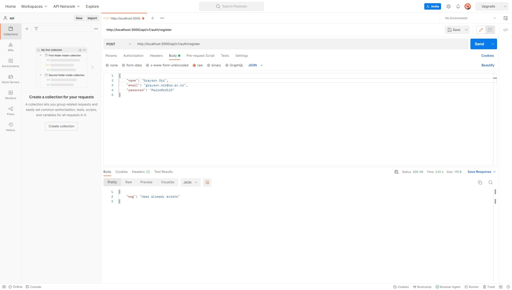
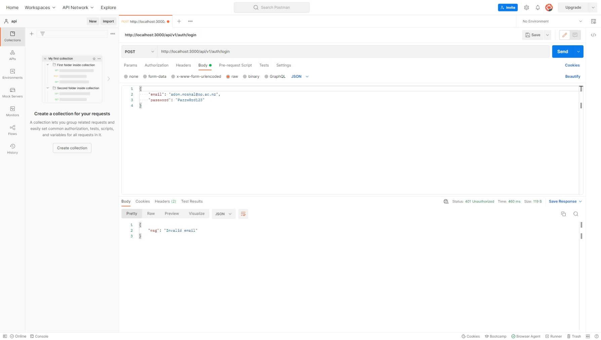
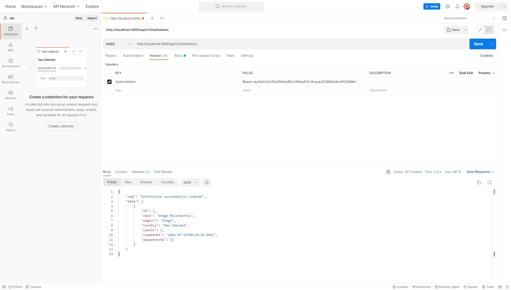

# Authentication

As a developer, you ideally want to safeguard sensitive data from being accessed by unauthorised users. Only when a user has logged in or authenticated they will be able to access their data. However, authorisation goes beyond authentication. Users can have different roles and permissions, which gives them specific access. For example, an admin user can create, update and delete a resource, but a normal user can only read a resource.

## Token vs. Session

Token based authentication is stateless, session based authentication is stateful. This means that the server does not need to keep track of the user's session. The user sends the token with every request, and the server can verify the token without having to store any information about the user.

## JSON Web Tokens (JWT)

**JWT** is an open standard that defines a compact and self-contained way for securely transmitting information between parties as a JSON object. This information can be verified and trusted because it is digitally signed. **JWT**s can be signed using a secret or a public/private key pair.

To get started, run the following command:

```bash
npm install jsonwebtoken bcryptjs
```

Check the `package.json` file to ensure you have installed `jsonwebtoken` and `bcryptjs`.

In the `.env` file, add the following environment variables:

```bash
JWT_SECRET=Pazzw0rd123
JWT_LIFETIME=1hr
```

The `.env` file should look like this:

```bash
PORT=3000
DATABASE_URL=The PostgreSQL connection string
SHADOW_DATABASE_URL=The PostgreSQL connection string
JWT_SECRET=Pazzw0rd123
JWT_LIFETIME=1hr
```

You will use the `JWT_SECRET` environment variable's value, i.e., Pazzw0rd123, to sign the **JWT**. The lifetime of the **JWT** is the `JWT_LIFETIME` environment variable's value, i.e., 1 hour.

### Schema

In the `prisma.schema` file, add the following `User` model:

```js
model User {
  id              Int           @id @default(autoincrement())
  email           String        @unique
  name            String
  password        String
  createdAt       DateTime      @default(now())
  institutions    Institution[]
  departments     Department[]
}
```

**Note:** In both `Institution` and `Department` models, add a reference to the `User` model's id. Make sure you create a new migration using the commands `npx prisma migrate reset && npx prisma migrate dev`.

### middleware/authRoute.js

In the root directory, create a new directory called `middleware`. In the `middleware` directory, create a new file called `authRoute.js`. In the `authRoute.js` file, add the following code:

```js
import jwt from "jsonwebtoken";

const authRoute = (req, res, next) => {
  try {
    /**
     * The authorization request header provides information that authenticates
     * a user agent with a server, allowing access to a protected resource. The
     * information will be a bearer token, and a user agent is a middle man between
     * you and the server. An example of a user agent is Postman or a web browser
     * like Google Chrome
     */
    const authHeader = req.headers.authorization;

    /**
     * A bearer token will look something like this - Bearer <JWT>. A
     * response containing a 403 forbidden status code and message
     * is returned if a bearer token is not provided
     */
    if (!authHeader || !authHeader.startsWith("Bearer ")) {
      return res.status(403).json({
        msg: "No token provided",
      });
    }

    /**
     * Get the JWT from the bearer token
     */
    const token = authHeader.split(" ")[1];

    /**
     * Verify the signed JWT is valid. The first argument is the token,
     * i.e., JWT and the second argument is the secret or public/private key
     */
    const payload = jwt.verify(token, process.env.JWT_SECRET);

    /**
     * Set Request's user property to the authenticated user
     */
    req.user = payload;

    return next();
  } catch (error) {
    return res.status(403).json({
      msg: "Not authorized to access this route",
    });
  }
};

export default authRoute;
```

**Note:** You will use this middleware in the `app.js` file to protect the `institutions` and `departments` routes.

### controllers/v1/auth.js

In the `controllers/v1` directory, create a new file called `auth.js`. In the `auth.js` file, add the following code:

```js
import bcryptjs from "bcryptjs";
import jwt from "jsonwebtoken";

import { PrismaClient } from "@prisma/client";
const prisma = new PrismaClient();

const register = async (req, res) => {
  try {
    const { name, email, password } = req.body;

    let user = await prisma.user.findUnique({ where: { email } });

    if (user) {
      return res.status(409).json({ msg: "User already exists" });
    }

    /**
     * A salt is random bits added to a password before it is hashed. Salts
     * create unique passwords even if two users have the same passwords
     */
    const salt = await bcryptjs.genSalt();

    /**
     * Generate a hash for a given string. The first argument
     * is a string to be hashed, i.e., Pazzw0rd123 and the second
     * argument is a salt, i.e., E1F53135E559C253
     */
    const hashedPassword = await bcryptjs.hash(password, salt);

    user = await prisma.user.create({
      data: { name, email, password: hashedPassword },
    });

    /**
     * Delete the password property from the user object. It
     * is a less expensive operation than querying the User
     * table to get only user's email and name
     */
    delete user.password;

    return res.status(201).json({
      msg: "User successfully registered",
      data: user,
    });
  } catch (err) {
    return res.status(500).json({
      msg: err.message,
    });
  }
};

const login = async (req, res) => {
  try {
    const { email, password } = req.body;

    const user = await prisma.user.findUnique({ where: { email } });

    if (!user) {
      return res.status(401).json({ msg: "Invalid email" });
    }

    /**
     * Compare the given string, i.e., Pazzw0rd123, with the given
     * hash, i.e., user's hashed password
     */
    const isPasswordCorrect = await bcryptjs.compare(password, user.password);

    if (!isPasswordCorrect) {
      return res.status(401).json({ msg: "Invalid password" });
    }

    const { JWT_SECRET, JWT_LIFETIME } = process.env;

    /**
     * Return a JWT. The first argument is the payload, i.e., an object containing
     * the authenticated user's id and name, the second argument is the secret
     * or public/private key, and the third argument is the lifetime of the JWT
     */
    const token = jwt.sign(
      {
        id: user.id,
        name: user.name,
      },
      JWT_SECRET,
      { expiresIn: JWT_LIFETIME }
    );

    return res.status(200).json({
      msg: "User successfully logged in",
      token: token,
    });
  } catch (err) {
    return res.status(500).json({
      msg: err.message,
    });
  }
};

export { register, login };
```

### controllers/v1/institutions.js

In the `controllers/v1/institutions.js` file, refactor the `createInstitution` function:

```js
const createInstitution = async (req, res) => {
  try {
    const { name, region, country } = req.body;

    /**
     * Get the authenticated user's id from the Request's user property
     */
    const { id } = req.user;

    /**
     * Now you will know which authenticated user created which institution
     */
    await prisma.institution.create({
      data: { name, region, country, userId: id },
    });

    const newInstitutions = await prisma.institution.findMany({
      include: {
        departments: true,
      },
    });

    return res.status(201).json({
      msg: "Institution successfully created",
      data: newInstitutions,
    });
  } catch (err) {
    return res.status(500).json({
      msg: err.message,
    });
  }
};
```

### routes/v1/auth.js

In the `routes/v1` directory, create a new file called `auth.js`. In the `auth.js` file, add the following code:

```js
import { Router } from "express";
const router = Router();

import { register, login } from "../../controllers/v1/auth.js";

router.route("/register").post(register);
router.route("/login").post(login);

export default router;
```

### app.js

In the `app.js` file, add the following imports:

```js
import auth from "./routes/v1/auth.js";
import authRoute from "./middleware/authRoute.js";
```

Add the following route for `auth`:

```js
app.use(`/${BASE_URL}/${CURRENT_VERSION}/auth`, auth);
```

Update the routes for `institutions` so that it is using the `authRoute` **middleware**:

```js
app.use(
  `/${BASE_URL}/${CURRENT_VERSION}/institutions`,
  authRoute,
  institutions
);
```

**Resources:**

- <https://jwt.io/introduction>
- <https://www.npmjs.com/package/jsonwebtoken>
- <https://www.npmjs.com/package/bcryptjs>

---

## Postman

Test the changes in **Postman** before you move on to the **Formative Assessment** section.

The screenshot below is an example of registering a user.


The screenshot below is an example of registering an existing user.



The screenshot below is an example of logging in as a user with an invalid email.



The screenshot below is an example of logging in as a user with an invalid password.


The screenshot below is an example of logging in as a user and being returned a token.


The screenshot below is an example of a **POST** request to a protected route without providing a token.


The screenshot below is an example of a **POST** request to a protected route using an authenticated user.



# Formative Assessment

Before you start, create a new branch called **07-formative-assessment**.

If you get stuck on any of the following tasks, feel free to use **ChatGPT** permitting, you are aware of the following:

- If you provide **ChatGPT** with a prompt that is not refined enough, it may generate a not-so-useful response
- Do not trust **ChatGPT's** responses blindly. You must still use your judgement and may need to do additional research to determine if the response is correct
- Acknowledge that you are using **ChatGPT**. In the **README.md** file, please include what prompt(s) you provided to **ChatGPT** and how you used the response(s) to help you with your work

## Task Tahi

If you have not already, implement the code examples above before you move on to **Task Rua**.

## Task Rua

In the `schema.prisma` file, add a new field called `username` of type `String` that is unique to the `User` model. Make sure you create a new migration using the commands `npx prisma migrate reset && npx prisma migrate dev` before you move on to **Task Toru**.

## Task Toru

In the `controllers/v1/auth.js` file, refactor the `register` function so that the `username` is included when registering a new user. You have to check if the new user's `email` and `username` does not exist. **Note:** You will need to use the `findFirst` function instead of the `findUnique` function and the `OR` operator to filter the user by either is `email` or `username`. Test the changes in **Postman** before you move on to **Task Whā**.

## Task Whā

In the `controllers/v1/auth.js` file, refactor the `login` function so that the user can login with either their `email` and `password` or `username` and `password`. **Note:** You will use the same function and operator mentioned in **Task Toru**. Test the changes in **Postman** before you move on to the **Formative Assessment Submission**.

# Formative Assessment Submission

Create a new pull request and assign **grayson-orr** to review your practical submission. Please don't merge your own pull request.
